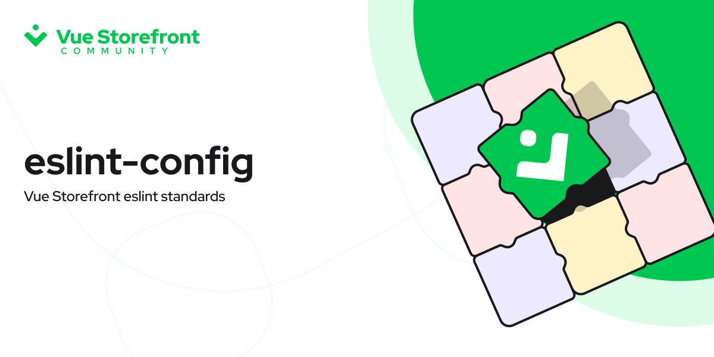

[]()

# @vue-storefront/eslint-config

[![npm version][npm-version-src]][npm-version-href]
[![npm downloads][npm-downloads-src]][npm-downloads-href]
[![License][license-src]][license-href]

> Vue Storefront eslint standards

## Information

Eslint configuration for:
- JavaScript
- Typescript
- Nuxt 3
- Nuxt 2
- Vue 3
- Vue 2


For this eslint config package, we enable the following community standards:
- AirBnb
- Prettier

This configuration provides eslint rules for the following:
- TypeScript
- Vue
- Nuxt
- JSON
- YAML / YML
- Markdown

## Usage
### All Configs
#### Install
```bash
pnpm add -D eslint @vue-storefront/eslint-config
```

#### Config `.eslintrc`
```json
{
  "extends": "@vue-storefront"
}
```

### Base Config
#### Install
```bash
pnpm add -D eslint @vue-storefront/eslint-config-base
```

#### Config `.eslintrc`
```json
{
  "extends": "@vue-storefront/eslint-config"
}
```

### TypeScript Config
#### Install
```bash
pnpm add -D eslint @vue-storefront/eslint-config-typescript
```

#### Config `.eslintrc`
```json
{
  "extends": "@vue-storefront/eslint-config-typescript"
}
```

### Nuxt 3 Config
#### Install
```bash
pnpm add -D eslint @vue-storefront/eslint-config-nuxt
```

#### Config `.eslintrc`
```json
{
  "extends": "@vue-storefront/eslint-config-nuxt"
}
```

### Nuxt 2 Config
#### Install
```bash
pnpm add -D eslint @vue-storefront/eslint-config-nuxt2
```

#### Config `.eslintrc`
```json
{
  "extends": "@vue-storefront/eslint-config-nuxt2"
}
```

### Vue 3 Config
#### Install
```bash
pnpm add -D eslint @vue-storefront/eslint-config-vue
```

#### Config `.eslintrc`
```json
{
  "extends": "@vue-storefront/eslint-config-vue"
}
```

### Vue 2 Config
#### Install

```bash
pnpm add -D eslint @vue-storefront/eslint-config-vue2
```

#### Config `.eslintrc`
```json
{
  "extends": "@vue-storefront/eslint-config-vue2"
}
```

### Config VS Code auto fix

Update your `.vscode/settings.json` and add the following

```json
{
  "prettier.enable": true,
  "editor.codeActionsOnSave": {
    "source.fixAll.eslint": true
  }
}
```

## Contributing

You can contribute to this module online with CodeSandBox:

[](https://codesandbox.io/s/github/vuestorefront/eslint-config/tree/main/?fontsize=14&hidenavigation=1&theme=dark)

Or locally:

1. Clone this repository
2. Install dependencies using `yarn install` or `npm install`
3. Start development server using `yarn dev` or `npm run dev`

## License

[MIT License](./LICENSE)

Copyright (c) Nuxt Team

<!-- Badges -->
[npm-version-src]: https://img.shields.io/npm/v/@vue-storefront/eslint-config/latest.svg
[npm-version-href]: https://npmjs.com/package/@vue-storefront/eslint-config

[npm-downloads-src]: https://img.shields.io/npm/dm/@vue-storefront/eslint-config.svg
[npm-downloads-href]: https://npmjs.com/package/@vue-storefront/eslint-config

[license-src]: https://img.shields.io/npm/l/@vue-storefront/eslint-config
[license-href]: https://npmjs.com/package/@vue-storefront/eslint-config